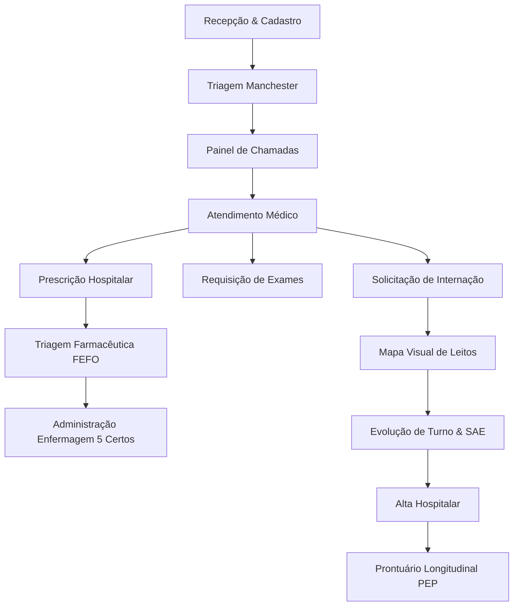

# SGH — Arquitetura do Sistema

## 1. Visão Geral

O **SGH (Sistema de Gestão Hospitalar)** é uma plataforma unificada de prontuário eletrônico e operação hospitalar construída para suportar todo o ciclo de cuidado ao paciente em unidades de pronto-atendimento, ambulatórios e hospitais de média/alta complexidade.

---

## 2. Stack Tecnológica

| Componente | Tecnologia | Papel |
| :--- | :--- | :--- |
| **Framework Web** | Next.js 16 (App Router) | Renderização híbrida (RSC e Client Components), rotas de API |
| **Interface** | React 19 + Tailwind CSS + Lucide Icons | Design system hospitalar, componentes responsivos |
| **Visualização / Gráficos** | Recharts | Dashboards analíticos, taxas de ocupação, curvas de atendimento |
| **ORM & Banco** | Prisma 7 + PostgreSQL | Modelagem relacional tipada, migrações e índices de performance |
| **Autenticação** | NextAuth.js + JWT + Sessões Persistidas | Gestão de sessão, RBAC hospitalar, revogação remota |
| **Segurança & Criptografia** | Web Crypto API / Node.js Crypto | AES-256-GCM para dados sensíveis, SHA-256 para indexação e tokens |
| **MFA** | TOTP RFC 6238 nativo | Autenticação em dois fatores sem dependências externas |
| **Comunicação Tempo Real** | Pusher Channels | Sincronização de painel de chamadas e filas de atendimento |
| **Geração de Documentos** | PDF-Lib | Fichas de urgência, laudos AIH, relatórios e prescrições |
| **Testes** | Vitest | Testes unitários e de integração de regras clínicas |

---

## 3. Módulos do Sistema

### 3.1 Recepção e Acolhimento (`/recepcao`)
- Cadastro ágil de pacientes com validação de CPF e preenchimento automático de CEP via ViaCEP.
- Criptografia automática de dados sensíveis antes da persistência no banco.
- Geração do número único de atendimento (`YYYYMMDD-XXXX`).

### 3.2 Triagem pelo Protocolo de Manchester (`/triagem`)
- Classificação de risco em 5 cores oficiais: Vermelho (Emergência), Laranja (Muito Urgente), Amarelo (Urgente), Verde (Pouco Urgente), Azul (Não Urgente).
- Coleta detalhada de sinais vitais (PA, FC, FR, SpO2, Temp, Glicemia, Escala de Dor, Peso/Altura com IMC automático).
- Cálculo automatizado de tempo alvo para primeiro atendimento médico.

### 3.3 Workspace do Atendimento Médico (`/atendimento`)
- Anamnese completa (HDA, antecedentes pessoais, familiares, cirúrgicos e hábitos de vida).
- Diagnósticos com busca rápida CID-10 e marcação de hipótese principal/secundária.
- Prescrição eletrônica com catálogo de medicamentos, posologia, vias e checagem de interações medicamentosas.
- Requisição de exames (Laboratório, Imagem, Cardiologia) com suporte a resultados estruturados e upload de laudos em PDF.
- Encaminhamentos internos, externos e solicitações de internação hospitalar (AIH).

### 3.4 Farmácia Hospitalar (`/farmacia`)
- Entrada de estoque com suporte à importação de XML de NF-e e controle de fornecedores.
- Rastreabilidade por Lote e Validade com dispensação orientada a **FEFO** (First Expired, First Out).
- Matriz de alerta de interações medicamentosas (Leve, Moderada, Crítica).
- Triagem farmacêutica de prescrições antes da liberação para enfermagem.

### 3.5 Enfermagem e Administração Segura (`/enfermagem` e `/medicacao`)
- Fila operacional de aplicações com verificação obrigatória do **Checklist dos 5 Certos** (Paciente certo, Medicamento certo, Dose certa, Via certa, Horário certo).
- Contagem e registro de doses subsequentes com rastreabilidade do aplicador.

### 3.6 Internamento e Mapa Visual de Leitos (`/internamento/mapa-leitos`)
- Painel visual interativo com taxa de ocupação, leitos livres, ocupados, isolamento e interditados.
- Transferência atômica de leitos entre clínicas e alas com registro em trilha de auditoria.
- Fichas hospitalares especializadas: Laudo AIH, Ficha de Internação/Alta, Notificação CCIH, Ficha Multidisciplinar, Evolução de Turno (Diurna/Noturna), Controle Horário de Sinais Vitais e SAE.

### 3.7 Prontuário Eletrônico Longitudinal (`/prontuario/paciente/[id]`)
- Visão centralizada de todo o histórico clínico do paciente ao longo do tempo.
- Linha do tempo com episódios de triagem, consultas médicas, internações, diagnósticos históricos, exames laboratoriais estruturados e prescrições.

### 3.8 Central de Tarefas & Pendências Clínicas (`/dashboard`)
- Painel operacional inteligente com contadores e alertas em tempo real categorizados por perfil profissional.
